<p align="center">
  
</p>

# ⚡ GitPulse: The Open Source Intelligence Layer

Created by [**Vishesh Sanghvi**](https://www.linkedin.com/in/vishesh-sanghvi/) • [Portfolio](https://vishesh-ai.vercel.app/)

[](https://github.com/visheshsanghvi112/GitPulse/actions/workflows/ci.yml)
[](https://github.com/visheshsanghvi112/GitPulse/actions/workflows/security.yml)


**GitPulse** is a high-fidelity, real-time intelligence dashboard for the GitHub ecosystem. It provides deep insights into trending repositories, historical rankings, and language distributions through a stunning, motion-driven Cyberpunk-inspired interface.

---

## 👁️ The Vision

In a sea of millions of GitHub repositories, finding the true "Alpha"—the next React, Next.js, or Linux—before it hits the mainstream is incredibly difficult. GitPulse was built to act as an **Intelligence Layer**. We process millions of data points to bring you the most relevant software trends, track repository star velocity, and monitor language ecosystem shifts in real-time.

---

## ✨ Core Telemetry Features

- **🔥 Hyper-Velocity Tracking**: Live tracking of high-impact repositories using the GitHub Search API (`pushed:>` filters with aggressive star thresholds).
- **🏆 Ecosystem Rankings**: Definitive global top-100 rankings across 28+ specific programming languages.
- **📊 Deep Matrix Analytics**: Visualized intelligence including language distributions, average star velocities, and scatter-plot trajectory modeling.
- **🛡️ Zero-Downtime Engine**: A bespoke dual-layer hybrid architecture that intelligently falls back from live GitHub REST API data to cached local daily JSON snapshots if rate-limits are hit.

---

## 🎨 UI & Aesthetics

GitPulse breaks away from standard "boring SaaS" dashboards.
- **Cyber-Aesthetic Charts**: Custom SVG `<defs>` dynamically injected into Recharts to render stunning neon gradients (Plasma, Aurora, Neon Pink).
- **Motion Engine**: Powered by `framer-motion` for scroll-triggered parallax floating repository cards, physics-based modal drawers, and magnetic buttons.
- **Glassmorphism**: Heavy use of `backdrop-blur`, sub-pixel borders, and subtle radial gradient flares to simulate a living software interface.

> **Note on Visuals:** To see the full visual experience, ensure your monitor supports wide color gamuts (P3) to fully appreciate the saturated dashboard gradients.

---

## 🏗️ Project Architecture

```mermaid
graph TD
    A[User Browser] --> B[Next.js App Router]
    B --> |Live Telemetry| C{GitHub API Rate Limit?}
    C -->|Healthy| D[Fetch Live Data]
    C -->|Exceeded / 403| E[Fallback to Local Snapshots]
    F[GitHub Actions Cron] --> |Midnight Sync| G[fetchAndStore.js]
    G --> |Generate| E
    B --> H[Recharts + Framer UI]
    style A fill:#6366f1,stroke:#fff,stroke-width:2px
    style B fill:#1e293b,stroke:#fff,stroke-width:2px
    style C fill:#f43f5e,stroke:#fff,stroke-width:2px
```



---

## 🛠️ Technology Stack

- **Framework**: Next.js 15 (React 19 ecosystem)
- **Styling**: Tailwind CSS + Custom Design System
- **Motion**: Framer Motion (Spring physics & staggering)
- **Data Visualization**: Recharts (High-performance SVG charts)
- **Data Fetching**: Axios + custom `useSnapshots` hook
- **Automation**: GitHub Actions (Cron Jobs)

---

## 🚀 Getting Started

### 1. Clone & Install
```bash
git clone https://github.com/visheshsanghvi112/GitPulse.git
cd GitPulse
npm install
```

### 2. Environment Setup
Create a `.env.local` file and add your GitHub Personal Access Token. This is **mandatory** for live tracking, otherwise the app falls back to snapshot data:
```env
GITHUB_TOKEN=your_github_token_here
```
*Generating a fine-grained token with public repository read access ensures you bypass the strict unauthenticated API rate limits (60/hr -> 5000/hr).*

### 3. Launch the Matrix
```bash
npm run dev
```
Navigate to `http://localhost:3000` to access the terminal.

---

## 📸 Screenshots

*(Replace these placeholders with actual high-res screenshots of your dashboard)*
- `[Screenshot 1: The Parallax Hero Page with Live Ticker]`
- `[Screenshot 2: The Neon Analytics Dashboard with Scatter Plot]`

---

## 👤 Creator

**Vishesh Sanghvi**
- 🔗 [LinkedIn](https://www.linkedin.com/in/vishesh-sanghvi/)
- 🌐 [Portfolio](https://vishesh-ai.vercel.app/)

---

## 📄 License
MIT • Crafted for the open-source community by Vishesh Sanghvi.
