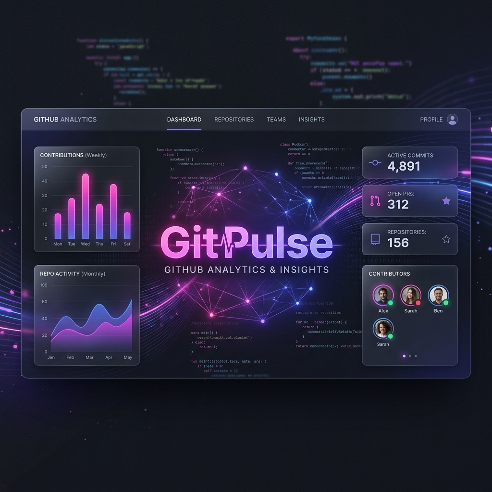

<p align="center">
  
</p>

# ⚡ GitPulse: The Open Source Intelligence Layer

Created by [**Vishesh Sanghvi**](https://www.linkedin.com/in/vishesh-sanghvi/) • [Portfolio](https://vishesh-ai.vercel.app/)

[](https://github.com/visheshsanghvi112/GitPulse/actions/workflows/ci.yml)
[](https://github.com/visheshsanghvi112/GitPulse/actions/workflows/security.yml)


**GitPulse** is a high-fidelity, real-time intelligence dashboard for the GitHub ecosystem. It provides deep insights into trending repositories, historical rankings, and language distributions through a stunning, motion-driven interface.

---

## ✨ Key Features

- **🔥 Real-time Trending**: Live tracking of high-impact repositories using the GitHub Search API.
- **🏆 Ecosystem Rankings**: Definitive Top-100 rankings for 28+ programming languages.
- **📊 Rich Analytics**: Visualized intelligence including language distributions and repository impact charts.
- **💎 Premium UX**: A meticulously crafted glassmorphic interface with background pulsing glows, spring-based animations, and responsive card layouts.
- **⚡ Hybrid Architecture**: Intelligent fallback system that switches between Live API data and cached JSON snapshots for zero-downtime reliability.
- **📈 Scroll Intelligence**: Top-mounted scroll progress indicators and staggering grid animations.

---

## 🏗️ Project Architecture

```mermaid
graph TD
    A[User Browser] --> B[Next.js Frontend]
    B --> C[Live GitHub API]
    B --> D[Local JSON Snapshots]
    E[GitHub Actions] --> |Daily Schedule| F[fetchAndStore.js]
    F --> |Commit| D
    G[Historical Data] --> |CSV/Markdown| B
    style A fill:#6366f1,stroke:#fff,stroke-width:2px
    style B fill:#1e293b,stroke:#fff,stroke-width:2px
    style E fill:#f43f5e,stroke:#fff,stroke-width:2px
```



---

## 🛠️ Technology Stack

- **Framework**: Next.js 15 (App Router ready)
- **Styling**: Tailwind CSS + Custom Design System
- **Motion**: Framer Motion (Spring physics & staggering)
- **Analytics**: Recharts (High-performance SVG charts)
- **Data**: Axios + SWR (Stale-While-Revalidate caching)
- **Testing**: Vitest + Testing Library

---

## 🚀 Getting Started

### 1. Clone & Install
```bash
git clone https://github.com/visheshsanghvi112/GitPulse.git
cd GitPulse
npm install
```

### 2. Environment Setup
Create a `.env.local` file and add your GitHub Personal Access Token:
```env
GITHUB_TOKEN=your_github_token_here
```
*Generating a token with `repo` scope ensures you avoid API rate limiting.*

### 3. Launch
```bash
npm run dev
```
Navigate to `http://localhost:3000` to see the pulse of open source.

---

## 👤 Creator

**Vishesh Sanghvi**
- 🔗 [LinkedIn](https://www.linkedin.com/in/vishesh-sanghvi/)
- 🌐 [Portfolio](https://vishesh-ai.vercel.app/)

---

## 📄 License
MIT • Crafted for the open-source community by Vishesh Sanghvi.

